# 💸 Budget Tracking System
## AI-Powered Expense Tracking & Budget Forecasting Platform
## 📌 Overview

Budget Tracking System is a web-based application designed to help users track their income and expenses while providing AI-driven budget forecasts based on historical spending behavior.

Unlike traditional expense trackers, this system integrates time-series forecasting models to predict future budget needs, enabling users to make more informed financial decisions.

## 🎯 Project Goals

Record and manage user income and expenses

Categorize financial transactions

Analyze historical spending data

Generate monthly budget forecasts using machine learning

Improve users’ financial awareness through data visualization

## 🧠 System Architecture
### Backend

Python (Flask)

Flask-SQLAlchemy

Flask-Login (Authentication)

MSSQL

### Frontend

HTML5

CSS3 (Custom Styling)

Jinja2 Templates

### AI & Forecasting

Time Series Analysis

Facebook Prophet for monthly budget prediction

## 🖼️ Application Screenshots

Below are real screenshots from the Budget Tracking System application, showcasing key features and user interfaces.

## 🔐 Authentication

Login Page

 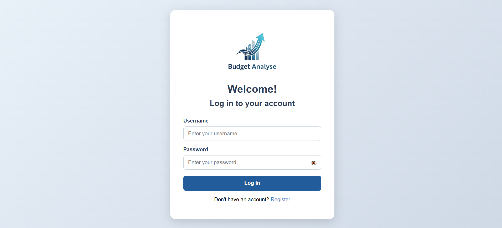 

Register Page

 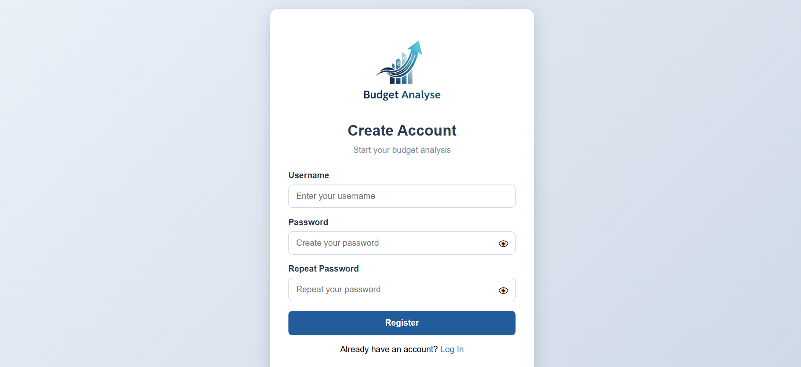 

## 📊 Dashboard

The dashboard provides an overview of the user’s financial status with visual summaries.

Dashboard – Overview

 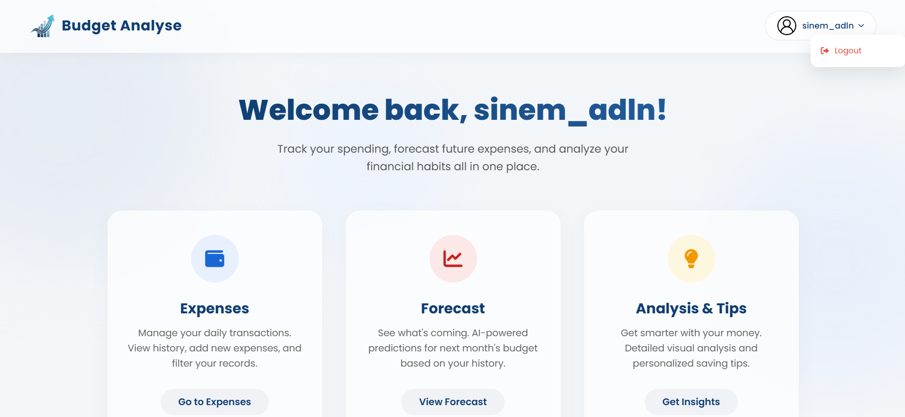 

Dashboard – Detailed View

 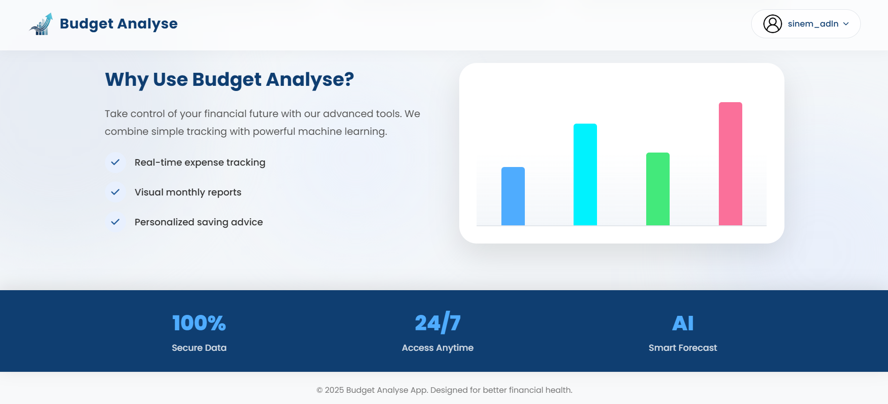 

## 💾 Expense Management

Users can add and manage their expenses and view historical records.

Add Expense Page

 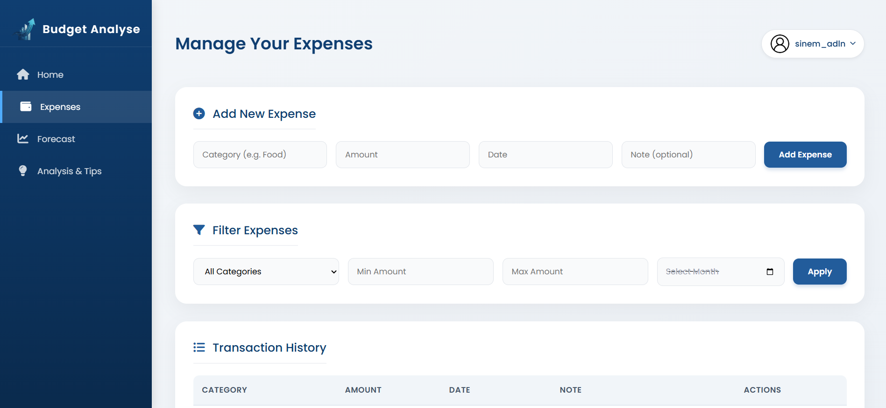 

Expense History

 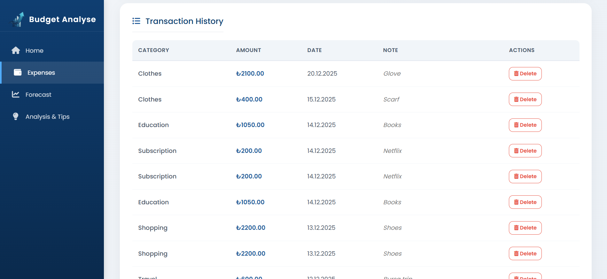 

## 🤖 Budget Forecasting

The forecasting module predicts future expenses based on historical data using a time-series model.

Forecast – Result 1

 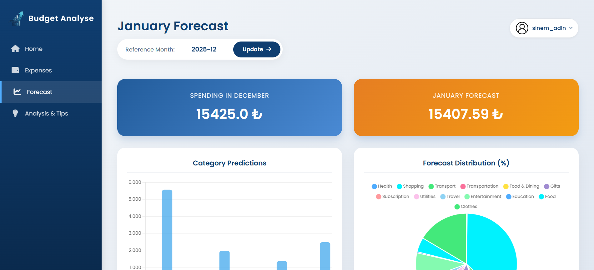 

Forecast – Result 2

 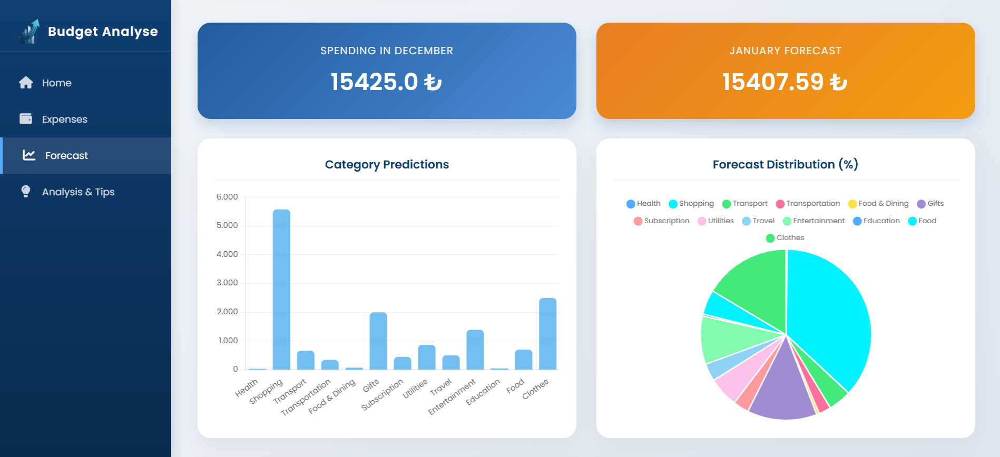 

Forecast – Result 3

 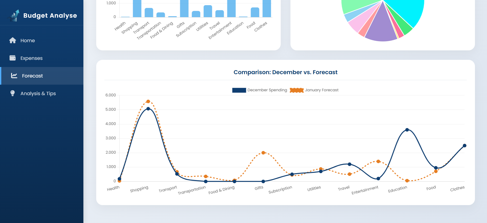 

## 📈 Analysis Module

The analysis section helps users understand their spending patterns through multiple visual insights.

Analysis – View 1

 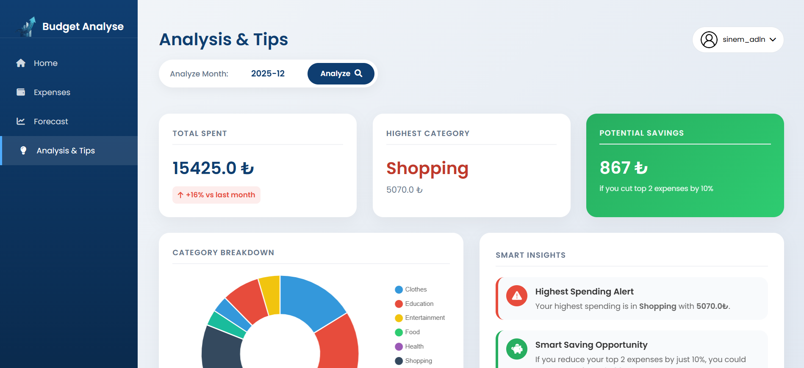 

Analysis – View 2

  

Analysis – View 3

 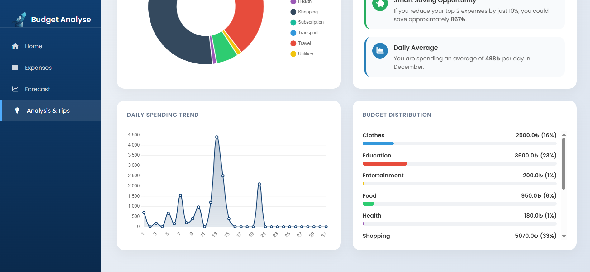 

## ⚙️ Key Features
## 🔐 User Authentication

Secure login and registration

Password hashing

Session management with Flask-Login

## 💾 Expense Management

Add income and expenses

Category-based tracking

Date-based historical records

## 🤖 AI-Based Budget Forecasting

Monthly time-series modeling

Historical data aggregation

Future budget predictions using Prophet

## 🧪 Forecasting Model

The forecasting process includes:

Aggregating expenses on a monthly basis

Cleaning and filling missing time periods

Training a Prophet time-series model

Predicting future monthly budget requirements

Why Prophet?

Performs well on small datasets

Handles seasonality and trends effectively

Suitable for financial time-series data

## 📊 Data Visualization

Monthly expense summaries

Category distribution analysis

Personalized financial dashboard

## 🗄️ Database Design

### Main database tables:

Users

Expenses

Categories

ForecastResults

### Sample Fields:

user_id

amount

category

transaction_date

created_at

## 🚀 Installation & Setup
### Clone the repository
git clone https://github.com/sinemadalan/budget_tracking.git

### Create virtual environment
python -m venv venv
source venv/bin/activate  # Windows: venv\Scripts\activate

### Install dependencies
pip install -r requirements.txt

### Run the application
flask run

## 📁 Project Structure
budget_tracking/

├── app.py

├── data_values.sql

├── requirements.txt

├── static/

│ └── images/

│ ├── budget.png

│ └── budget_sidebar.png

├── templates/

│ ├── index.html

│ ├── login.html

│ ├── register.html

│ ├── expenses.html

│ ├── analysis.html

│ └── forecast.html

└── README.md

## 👩‍💻 Author

Sinem Adalan

Software Engineering Student

Interests: AI, Data Science, Web Development

## ⭐ Conclusion

The Budget Tracking System demonstrates the integration of software engineering principles, database management, and machine learning in a real-world financial application.

It serves as a scalable foundation for intelligent personal finance systems and showcases practical AI usage in budget forecasting.
